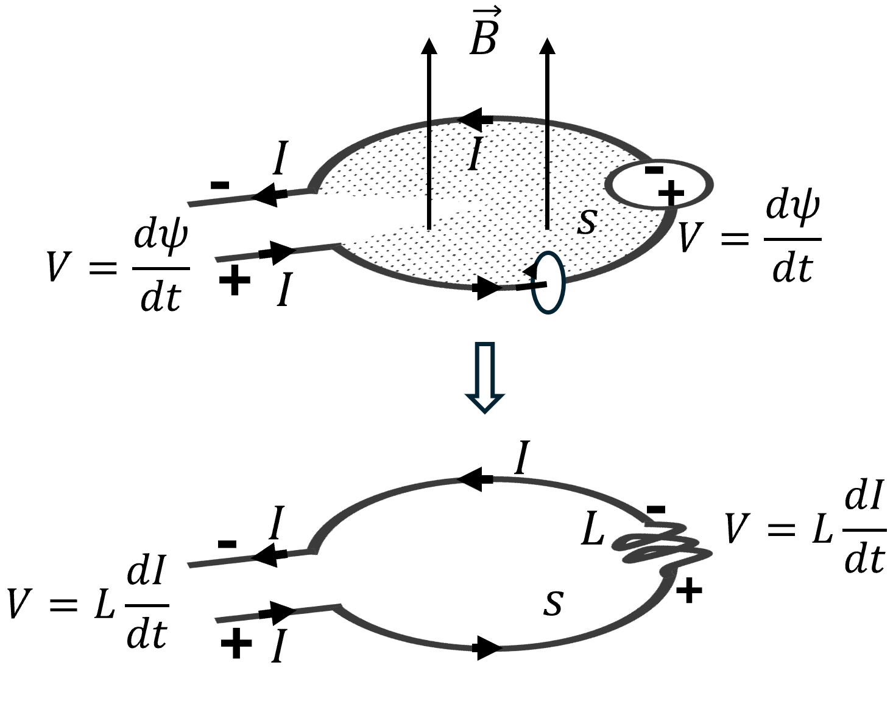

# Practice School 8th Semester

## Resistance 

- Consider a block of metal or semiconductor material with dimensions $L$, $W$ and $h$ as shown in figure above.
- Let $n$ be the charge per unit volume.
- To calculate the current $Ir$ for an applied voltage $Vr$ across the length of the material, we will consider an incremental cross section of the material with length $Δx$.
- The current can be written as the total charge in the incremental volume in time $Δt$.

$$ I_R = \frac{\Delta Q}{\Delta t} = \frac{Q_S \Delta x}{\Delta t} = Q_S v_d $$
$$ I_R = \text{SheetCharge} \times \text{AverageVelocity} $$
$$ I_R = \mu Q_S \frac{\Delta v}{\Delta x} $$
$$ \Delta R = \frac{\Delta v}{I_R} = \rho \frac{\Delta x}{W h} $$
$$ R = \left( \frac{\rho}{h} \right) \left( \frac{L}{W} \right) $$
$$ R = \rho \frac{L}{A} $$

- Here $Qs$ is the sheet-charge or the charge per unit length, $Vd$ is the average velocity of the electrons.
- Where $μ$ is the mobility of the material, $ρ$ is the Specific resistivity which is a property of the material that can be defined as the resistance per unit volume expressed in SI units of $Ωm$ but more conveniently as $Ωcm$.
- Here $ρ/h$ is typically called sheet-rho ($ρsheet$).
- The total resistance of the volume can be found by summing up all incremental resistances $ΔR$ resulting in $R$.
- **Resistance**: [Pratice Problem](https://www.dropbox.com/scl/fi/akw1igk4q6rrtgzgmkp31/Hw-Qsn-1.pdf?rlkey=te8vz28qz29p8hrgksnzqi85p&st=g9kje02g&dl=0)

## Characteristics of Materials

| Material  | Resistivity (in &#8486;m) | Sheet Rho (in m&#8486;) | Melting Point | Cost per 10gm | Temperature Coefficient (ppm per &#8451;) |
| - | - | - | - | - | - |
| Aluminium  | 2.65 | 26.5 | 660 &#8451; | &#8377; 2.44 | 4300 |
| Copper  | 1.68 | 16.8 | 1084.62 &#8451; | &#8377; 8.53 | 3900 |
| Gold  | 2.44 | 24.4 | 1064.18 &#8451; | &#8377; 80,000 | 3400 |

## Capacitance
  

- Consider two parallel metal plates of area $A$ separated by distance $d$ as shown in the figure.
- If the total charge on the top and bottom plate is $+Q$ and $-Q$ respectively, and the potential on the plates are $V1$ and $V2$ respectively, total charge on the plate is directly proportional to the potential difference ($V = V1 - V2$):  $Q ∝ V$
- And the proportionality constant is the capacitance $C$ of the parallel plates: $Q = CV$
- In order to calculate the capacitance of the parallel plates, we will apply Gauss’ law by enclosing the top plate (or bottom plate), as show in figure and calculate the total electric field diverging from the enclosed volume.
- Assuming a large area and small separation, the peripheral electric field can be neglected and average electric field $E$ can be expressed as:
  
$$ \vec{E} = \frac{V}{d} $$
$$ \int \vec{E} \cdot d\vec{a} = \frac{Q}{\epsilon_0} $$
$$ EA = \frac{V}{d} A = \frac{Q}{\epsilon_0} $$
$$ C = \frac{A \epsilon_0}{d} $$
$$ C = \frac{A (1 + \chi) \epsilon_0}{d} = \frac{A \kappa \epsilon_0}{d} $$

- where, $X$ is the dielectric $susceptibility$ and $K$ is the $relative permittivity$.

**Capacitance, Permittivity and Solved Problems**: [Notes](https://www.dropbox.com/scl/fi/muitikoxgb389i8jmdgjk/Day-2.pdf?rlkey=tubkt8k9z9znosoi1mq91v44r&st=875cu8h6&dl=0)

## Capacitors

| Types  | Cap. Range | Max. Voltage Range | Accuracy | Temp. Stability | Leakage | Comments |
| - | - | - | - | - | - | - |
| Ceramic | 1pf - 1uf | 50-30kv | Poor | Poor | Moderate | Small, Cheap, Most Popular |
| Mica | 1pF – 0.01µF | 100-600 V | Good | Excellent| Good | Excellent, good at RF | 
| Mylar | 0.001µF – 50μF | 50-600 V | Good | Poor | Good | Inexpensive, Good, popular |
| Teflon | 1000pF – 2μF | 50-200 V | Excellent | Best | Best | High quality, lowest dielectric absorption |
| Glass | 10pF – 1000pF | 100-600V | Good | Excellent | Excellent | Long-term stability |
| Porcelin | 100pF – 0.1µF | 50-400 V | Good | Good | Good | Good long-term stability |
| Tantalum | 0.1µF – 500µF | 6-100 V | Poor | Poor | Moderate | High capacitance, polarized, small, low inductance |
| Electrolytic | 0.1μF – 1.6F | 3-600 V | Terrible | Ghastly | Awful | Power supply filters, polarized, short life |
| Vacuum | 1pF – 5000pF | 2kV-36 kV | High | Excellent | Excellent | Transmitters |

## Inductance

- Consider the circular wire loop in with a small gap for introducing current $I$.
- This current circulates counter-clockwise around the loop creating a magnetic flux density $B$ through the surface $s$ the loop encloses.
- The surface’s shape doesn’t affect the result, as long as the loop encircles it. With counter-clockwise current, the magnetic field is upward through the surface.
- The total magnetic flux through the loop can be calculated as:

