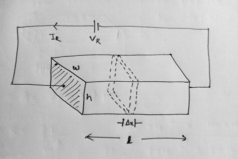
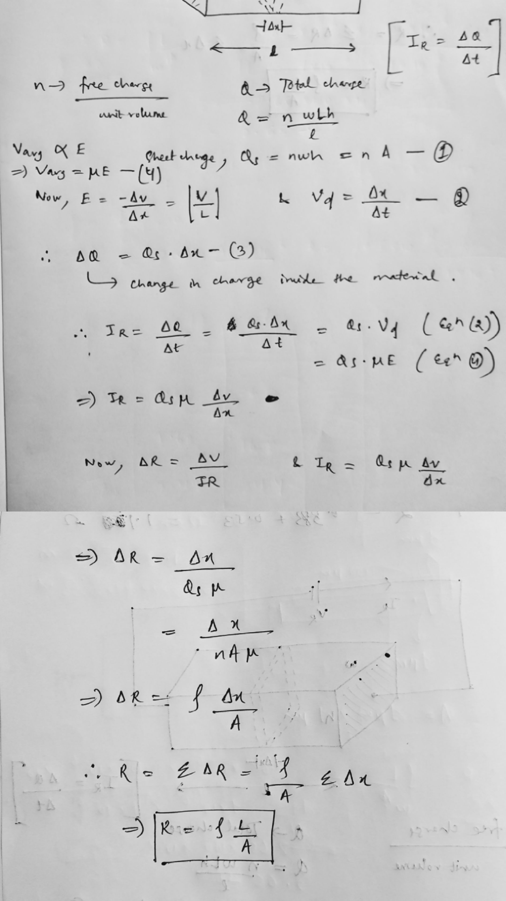
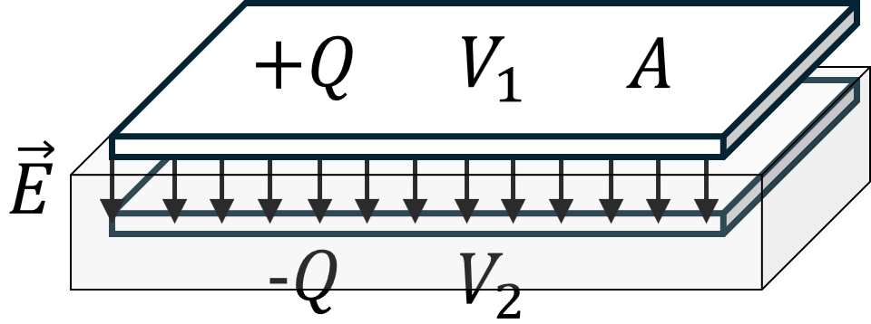

# Practice School 8th Semester

## Finding the current inside a material

 
- Given the voltage Vr, Current Ir, dimensions of the material l x w x h and n = $free charge/per unit volume$.
- To find the current Ir = $Change in charge(dQ) / Change in time (dt)$
- Let us take a thin sheet and find the sheet charge (Qs) and Q be the total charge of the material.

  

  **Resistance**: [Pratice Problem](https://www.dropbox.com/scl/fi/akw1igk4q6rrtgzgmkp31/Hw-Qsn-1.pdf?rlkey=te8vz28qz29p8hrgksnzqi85p&st=g9kje02g&dl=0)

  ## Characteristics of Material

| Material  | Resistivity (in &#8486;m) | Sheet Rho (in m&#8486;) | Melting Point | Cost per 10gm | Temperature Coefficient (ppm per &#8451;) |
| - | - | - | - | - | - |
| Aluminium  | 2.65 | 26.5 | 660 &#8451; | &#8377; 2.44 | 4300 |
| Copper  | 1.68 | 16.8 | 1084.62 &#8451; | &#8377; 8.53 | 3900 |
| Gold  | 2.44 | 24.4 | 1064.18 &#8451; | &#8377; 80,000 | 3400 |

  ## Capacitance and Permittivity
  

- Fig: Parallel plate capacitance

**Capacitance, Permittivity and Solved Problems**: [Notes](https://www.dropbox.com/scl/fi/muitikoxgb389i8jmdgjk/Day-2.pdf?rlkey=tubkt8k9z9znosoi1mq91v44r&st=875cu8h6&dl=0)

## Capacitors

| Types  | Cap. Range | Max. Voltage Range | Accuracy | Temp. Stability | Leakage | Comments |
| - | - | - | - | - | - | - |
| Ceramic | 1pf - 1uf | 50-30kv | Poor | Poor | Moderate | Small,Cheap,Most Popular |
| Mica | | | | | | |
| Mylar | | | | | | |
| Teflon | | | | | | |
| Glass | | | | | | |
| Porcelin | | | | | | |
| Tantalum | | | | | | |
| Electrolytic | | | | | | |
| Vacuum | | | | | | |

