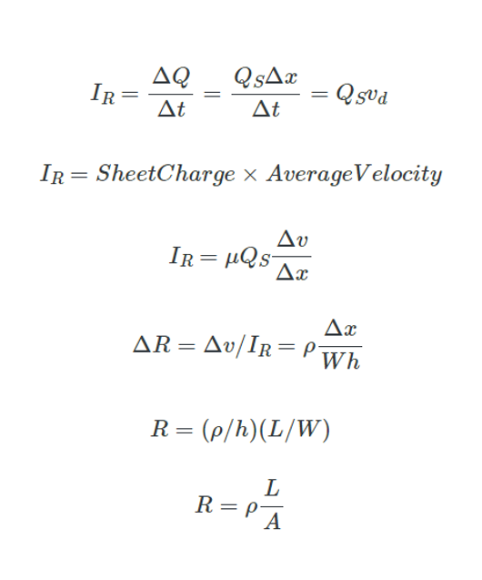

# Practice School 8th Semester

## Resistance 

- Consider a block of metal or semiconductor material with dimensions $L$, $W$ and $h$ as shown in figure above.
- Let $n$ be the charge per unit volume.
- To calculate the current $Ir$ for an applied voltage $Vr$ across the length of the material, we will consider an incremental cross section of the material with length $Δx$.
- The current can be written as the total charge in the incremental volume in time $Δt$.
  

- Here $Qs$ is the sheet-charge or the charge per unit length, $Vd$ is the average velocity of the electrons.
- Where $μ$ is the mobility of the material, $ρ$ is the Specific resistivity which is a property of the material that can be defined as the resistance per unit volume expressed in SI units of $Ωm$ but more conveniently as $Ωcm$.
- Here $ρ/h$ is typically called sheet-rho ($ρsheet$).
- The total resistance of the volume can be found by summing up all incremental resistances $ΔR$ resulting in $R$.
- **Resistance**: [Pratice Problem](https://www.dropbox.com/scl/fi/akw1igk4q6rrtgzgmkp31/Hw-Qsn-1.pdf?rlkey=te8vz28qz29p8hrgksnzqi85p&st=g9kje02g&dl=0)

## Characteristics of Materials

| Material  | Resistivity (in &#8486;m) | Sheet Rho (in m&#8486;) | Melting Point | Cost per 10gm | Temperature Coefficient (ppm per &#8451;) |
| - | - | - | - | - | - |
| Aluminium  | 2.65 | 26.5 | 660 &#8451; | &#8377; 2.44 | 4300 |
| Copper  | 1.68 | 16.8 | 1084.62 &#8451; | &#8377; 8.53 | 3900 |
| Gold  | 2.44 | 24.4 | 1064.18 &#8451; | &#8377; 80,000 | 3400 |

## Capacitance
  

- Consider two parallel metal plates of area $A$ separated by distance $d$ as shown in the figure.
- If the total charge on the top and bottom plate is $+Q$ and $-Q$ respectively, and the potential on the plates are $V1$ and $V2$ respectively, total charge on the plate is directly proportional to the potential difference ($V = V1 - V2$):

- Fig: Parallel plate capacitance

**Capacitance, Permittivity and Solved Problems**: [Notes](https://www.dropbox.com/scl/fi/muitikoxgb389i8jmdgjk/Day-2.pdf?rlkey=tubkt8k9z9znosoi1mq91v44r&st=875cu8h6&dl=0)

## Capacitors

| Types  | Cap. Range | Max. Voltage Range | Accuracy | Temp. Stability | Leakage | Comments |
| - | - | - | - | - | - | - |
| Ceramic | 1pf - 1uf | 50-30kv | Poor | Poor | Moderate | Small,Cheap,Most Popular |
| Mica | | | | | | |
| Mylar | | | | | | |
| Teflon | | | | | | |
| Glass | | | | | | |
| Porcelin | | | | | | |
| Tantalum | | | | | | |
| Electrolytic | | | | | | |
| Vacuum | | | | | | |

